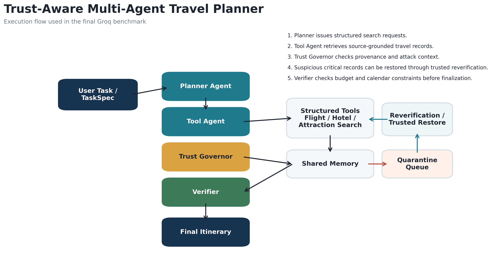

# Trust-Aware Multi-Agent Travel Planner

A research-oriented agentic AI system for constrained travel planning under unreliable or corrupted intermediate information.


## Overview

The planner compares three agent architectures on budget-, schedule-, availability-, and preference-constrained travel tasks:

- a single agent with deterministic tools;
- a naive multi-agent system with shared memory; and
- a trust-aware multi-agent system with provenance tracking, trust scoring, quarantine, controlled re-verification, and final constraint validation.

The repository also contains adversarial task generation, seven corruption modes, ablation variants, reproducible metrics, structured run traces, automated tests, a Streamlit inspection interface, and publication-oriented export scripts.

This is an experimental planning system backed by local benchmark snapshots. It does not query live airline or hotel inventory and should not be used to make real bookings.

## Why Trust-Aware Planning?

Multi-agent systems often pass tool outputs and intermediate claims through shared memory. If one observation is stale, incomplete, duplicated, or corrupted, the error can influence later agents and the final answer.

This project introduces a trust-governance layer between tool execution and shared memory. Each observation carries provenance, freshness, confidence, verification status, and corruption flags. The Trust Governor can accept an observation, lower its confidence, require re-verification, or quarantine it before the planner uses it.

## System Architecture

<p align="center">
  
</p>

The architecture illustrates the benchmark execution path from a structured user task through planning, tool retrieval, trust governance, shared memory, controlled re-verification, quarantine handling, constraint verification, and final itinerary generation.

### Core Components

| Component | Responsibility |
| --- | --- |
| Planner Agent | Builds structured search queries and selects a budget-aware candidate itinerary. |
| Tool Agent | Executes flight, hotel, and attraction searches against normalized local data. |
| Trust Governor | Scores observations and decides whether to accept, downgrade, re-verify, or quarantine them. |
| Shared Memory | Separates accepted entries from quarantined information while preserving provenance. |
| Verifier Agent | Checks budget, schedule, availability, baggage, and hotel-date constraints. |
| Evaluation Runner | Injects controlled attacks, runs system variants, saves traces, and computes metrics. |
| Streamlit Demo | Runs experiments and exposes itineraries, agent messages, quarantine events, verifier decisions, and metrics. |

The optional LangGraph runtime wraps a selected system variant in a state graph. The agent coordination and trust logic are implemented in the Python system classes.

## Implemented System Variants

| Variant | Description |
| --- | --- |
| `single_agent_tool_use` | Planner and verifier using the deterministic tool registry. |
| `naive_multi_agent_shared_memory` | Planner, Tool Agent, Verifier, and shared memory without defensive trust controls. |
| `trust_aware_multi_agent` | Full system with provenance, trust decisions, quarantine, re-verification, and verification. |
| `ablation_no_provenance` | Trust-aware architecture with provenance signals removed. |
| `ablation_no_quarantine` | Trust-aware architecture with quarantine disabled. |
| `ablation_no_verifier` | Trust-aware architecture without final constraint verification. |

## Tools and Model Backends

The tool registry provides structured flight, hotel, attraction, budget, calendar-constraint, and route-time operations. Planning can use:

- Groq through an OpenAI-compatible chat-completions endpoint;
- Ollama for local model inference; or
- deterministic heuristic planning when no model provider is available.

## Data and Evaluation

The normalized benchmark contains:

| Artifact | Records |
| --- | ---: |
| Cities | 8 |
| Flights | 288 |
| Hotels | 96 |
| Attractions | 96 |
| Routes | 672 |
| Development tasks | 15 |
| Clean evaluation tasks | 20 |
| Attacked evaluation tasks | 20 |

Source snapshots and derived-field notes are documented in [`project_code/data/source_grounded/SOURCES.md`](project_code/data/source_grounded/SOURCES.md). The data combines TravelPlanner reference material, OpenFlights route data, and OpenStreetMap/Overpass snapshots. Prices, availability, dates, and several other operational fields are deterministically derived for controlled evaluation; they are not live commercial records.

### Attack Modes

The attacked split covers seven controlled corruption modes:

- stale price;
- stale availability;
- conflicting schedule;
- dropped field;
- misleading summary;
- contaminated tool output; and
- conflicting duplicate record.

### Metrics

The evaluation pipeline records task success, hard-constraint satisfaction, attack success, contamination spread, recovery rate, verifier interventions, tool calls, defensive interventions, corrected attack targets, and latency.

## Reproducible Benchmark Snapshot

The following primary-system results are reproducible on the bundled 20 clean and 20 attacked tasks with `AGENTIC_MODEL_PROVIDER=none`. Percentages match the committed main-results poster artifact; latency is omitted because it depends on the runtime environment.

| System | Clean success | Attacked success | Attack success | Contamination spread | Recovery rate |
| --- | ---: | ---: | ---: | ---: | ---: |
| Single Agent | 100% | 70% | 85% | 55% | 0% |
| Naive Multi-Agent | 100% | 70% | 100% | 100% | 0% |
| Trust-Aware Multi-Agent | 100% | 100% | 0% | 0% | 100% |

In this benchmark, an attack is considered successful when it causes task failure or corrupted information spreads into accepted memory or the final itinerary. These figures measure controlled benchmark behavior, not performance on live travel data or previously unseen attack families.

## Repository Structure

| Path | Contents |
| --- | --- |
| `project_code/src/agents/` | Planner, Tool, Verifier, Trust Governor, and system variants. |
| `project_code/src/tools/` | Deterministic travel search and constraint tools. |
| `project_code/src/eval/` | Attack injection, feasibility logic, metrics, and experiment runner. |
| `project_code/src/models/` | Groq and Ollama model adapters. |
| `project_code/src/state/` | Task, observation, message, memory, plan, and trace schemas. |
| `project_code/data/` | Normalized knowledge, tasks, attack catalog, and source snapshots. |
| `project_code/tests/` | Unit and integration tests for planning, tools, trust logic, metrics, and exports. |
| `project_code/scripts/` | Data generation, normalization, result aggregation, and publication exports. |
| `project_code/demo_app.py` | Streamlit experiment and trace-inspection interface. |
| `paper/` and `poster/` | Research-paper and poster assets. |

## Quick Start

### 1. Clone the repository

```bash
git clone https://github.com/AbdSipra/trust-aware-multi-agent-travel-planner.git
cd trust-aware-multi-agent-travel-planner
```

### 2. Create a virtual environment

```bash
python -m venv .venv
```

Activate it on macOS or Linux:

```bash
source .venv/bin/activate
```

Activate it in Windows PowerShell:

```powershell
.venv\Scripts\Activate.ps1
```

### 3. Install dependencies

```bash
python -m pip install --upgrade pip
python -m pip install -r requirements.txt
```

The full publication-table export and its test also require Jinja2:

```bash
python -m pip install "Jinja2>=3.1"
```

### 4. Configure a runtime

Copy the example environment file:

```bash
cp .env.example .env
```

Windows PowerShell:

```powershell
Copy-Item .env.example .env
```

For Groq, set:

```dotenv
AGENTIC_MODEL_PROVIDER=groq
GROQ_API_KEY=your_api_key
GROQ_MODEL=llama-3.3-70b-versatile
```

For Ollama, set:

```dotenv
AGENTIC_MODEL_PROVIDER=ollama
OLLAMA_BASE_URL=http://localhost:11434
OLLAMA_MODEL=qwen2.5:7b-instruct
```

For deterministic offline execution, set:

```dotenv
AGENTIC_MODEL_PROVIDER=none
```

The repository already contains normalized benchmark data. Regeneration is optional.

## Run Experiments

Run the single-agent baseline on clean tasks:

```bash
python project_code/run_experiment.py \
  --task-split clean_eval_tasks \
  --system-variant single_agent_tool_use
```

Run the trust-aware system on attacked tasks:

```bash
python project_code/run_experiment.py \
  --task-split attacked_eval_tasks \
  --system-variant trust_aware_multi_agent
```

Use the optional LangGraph wrapper:

```bash
python project_code/run_experiment.py \
  --task-split attacked_eval_tasks \
  --system-variant trust_aware_multi_agent \
  --use-langgraph
```

Useful flags:

| Flag | Purpose |
| --- | --- |
| `--attack-mode <mode>` | Restrict matching attacked tasks to a selected attack mode. |
| `--task-limit <n>` | Run only the first `n` tasks. |
| `--no-save-traces` | Return metrics without writing trace JSON files. |
| `--use-langgraph` | Execute the selected variant through the LangGraph wrapper. |

Saved traces are written to `project_code/data/runs/` unless `--no-save-traces` is used.

## Launch the Demo

```bash
streamlit run project_code/demo_app.py
```

The interface supports system-variant selection, task-split selection, attack-mode filtering, experiment execution, benchmark tables, and per-task trace inspection.

## Run Tests

Install Jinja2 before running the complete suite, then execute:

```bash
python -m unittest discover -s project_code/tests -v
```

## Export Experiment Summaries

Aggregate the latest saved traces:

```bash
python project_code/scripts/export_experiment_summary.py \
  --model-provider groq \
  --output-dir project_code/results/groq_full_summary
```

Export publication tables:

```bash
python project_code/scripts/export_paper_tables.py \
  --summary-dir project_code/results/groq_full_summary
```

Export visualizations:

```bash
python project_code/scripts/export_paper_visualizations.py \
  --summary-dir project_code/results/groq_full_summary
```

## Current Limitations

- Travel inventory and prices are local benchmark data rather than live API responses.
- Controlled re-verification restores trusted reference values from the attack catalog; it is not an independent live-source lookup.
- The Trust Governor uses explicit benchmark signals and rule-based trust scores, so results do not establish robustness to unknown attacks.
- The LangGraph integration currently wraps each system variant in a single execution node rather than modeling every agent as a separate graph node.
- Route-time data exists in the tool registry but is not yet integrated into final itinerary selection.

## Suggested Next Steps

- Replace benchmark-controlled re-verification with independent multi-source validation.
- Represent each agent and recovery branch as explicit LangGraph nodes.
- Add live travel-provider adapters behind the existing tool interfaces.
- Introduce learned or calibrated trust scoring.
- Add continuous integration for tests and reproducible benchmark runs.
- Add a repository license and versioned releases.

## Data Attribution

The benchmark preparation uses TravelPlanner reference material, OpenFlights data, and OpenStreetMap/Overpass snapshots. See the repository's [source summary](project_code/data/source_grounded/SOURCES.md) for the included files and derived fields.
